# Penjualannya Adit - Aplikasi Kasir & Manajemen Toko Android

**RiusShop** adalah aplikasi kasir dan manajemen toko berbasis Android yang dibangun dengan **Kotlin** dan **Firebase**. Aplikasi ini memudahkan pengelolaan transaksi penjualan, laporan, produk, pegawai, dan cabang toko secara real-time.

## 📸 Screenshots

<table>
  <tr>
    <td align="center"><b>Dashboard</b></td>
    <td align="center"><b>Transaksi</b></td>
    <td align="center"><b>Pesanan / Cart</b></td>
  </tr>
  <tr>
    <td>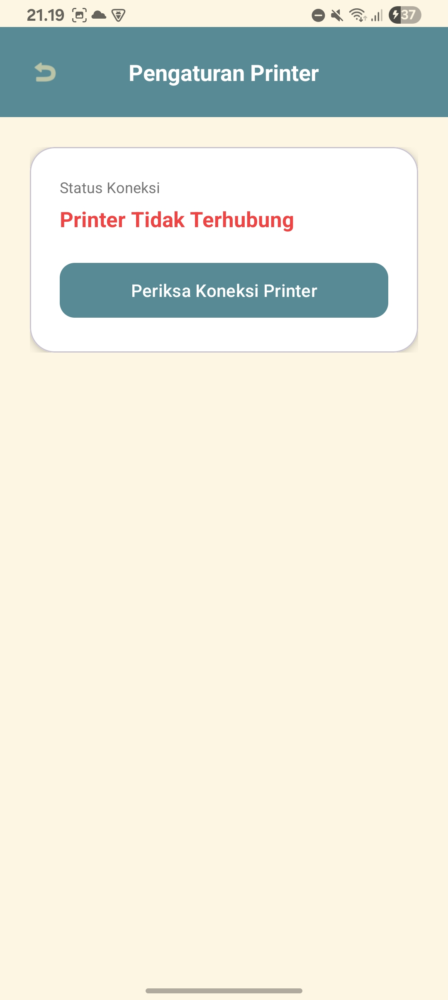</td>
    <td>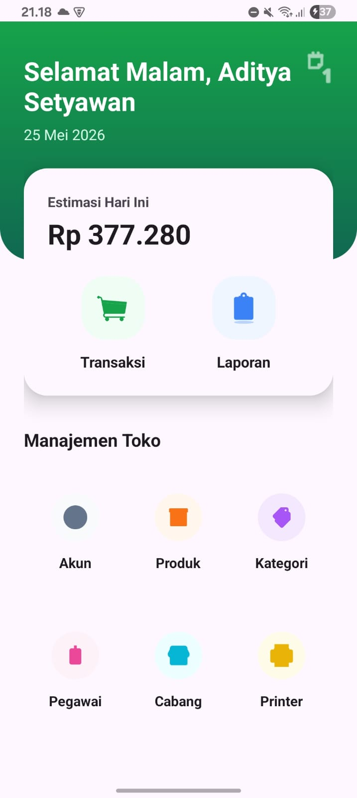</td>
    <td>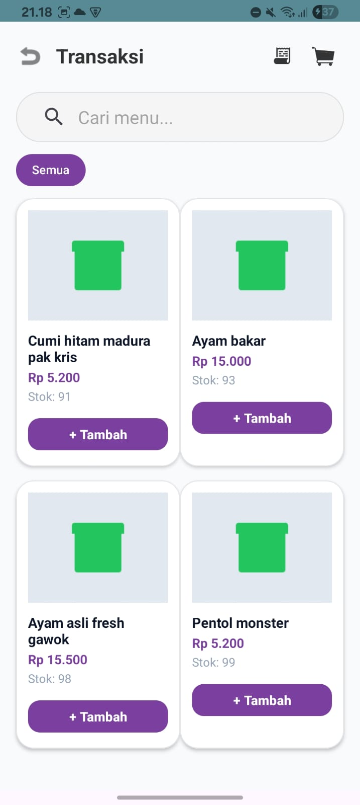</td>
  </tr>
  <tr>
    <td align="center"><b>Laporan Penjualan</b></td>
    <td align="center"><b>Nota Transaksi</b></td>
    <td align="center"><b>Daftar Menu / Produk</b></td>
  </tr>
  <tr>
    <td>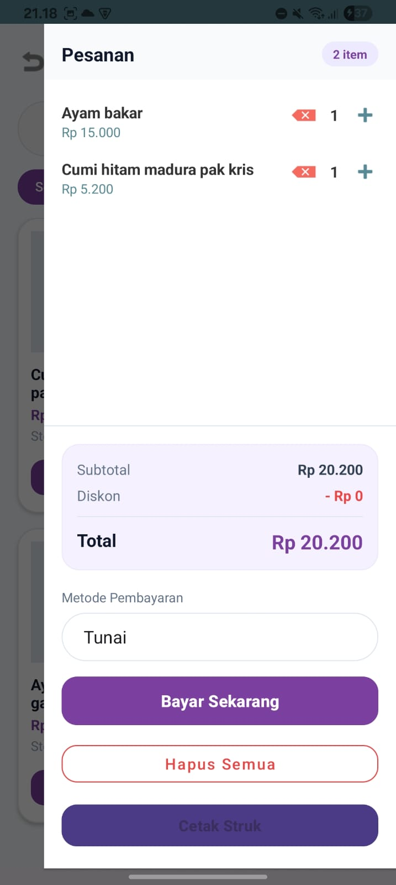</td>
    <td>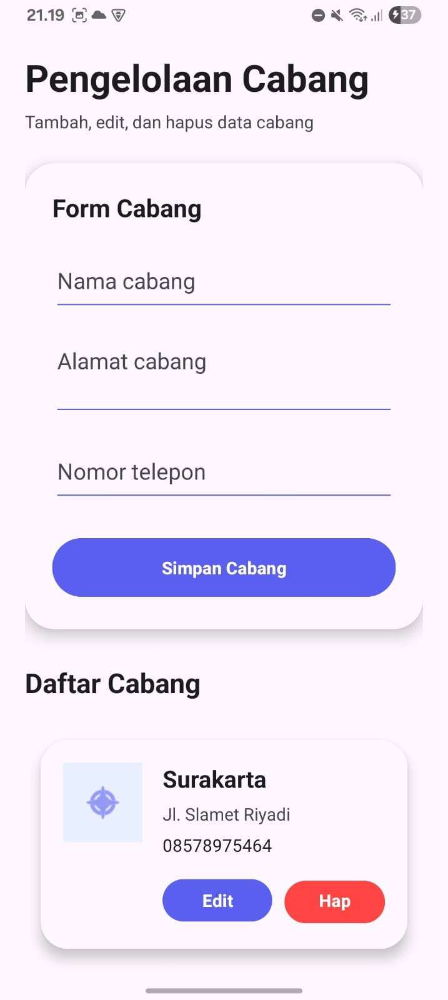</td>
    <td>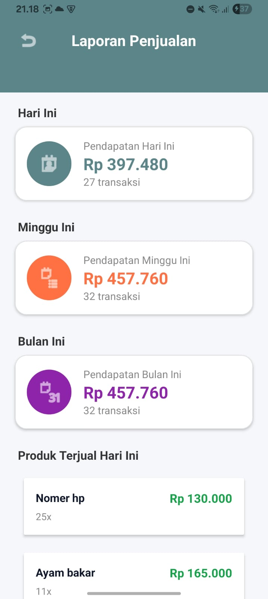</td>
  </tr>
  <tr>
    <td align="center"><b>Pengelolaan Cabang</b></td>
    <td align="center"><b>Pengelolaan Pegawai</b></td>
    <td align="center"><b>Daftar Pegawai</b></td>
  </tr>
  <tr>
    <td>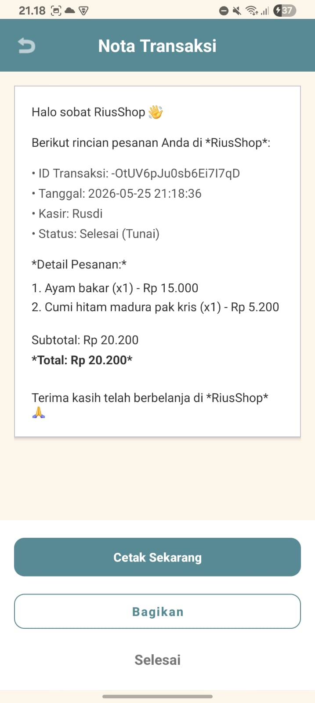</td>
    <td>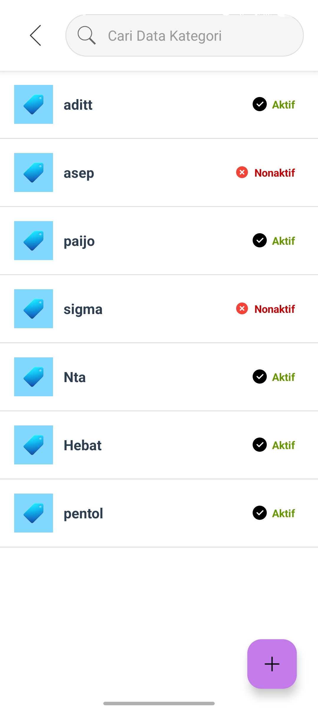</td>
    <td>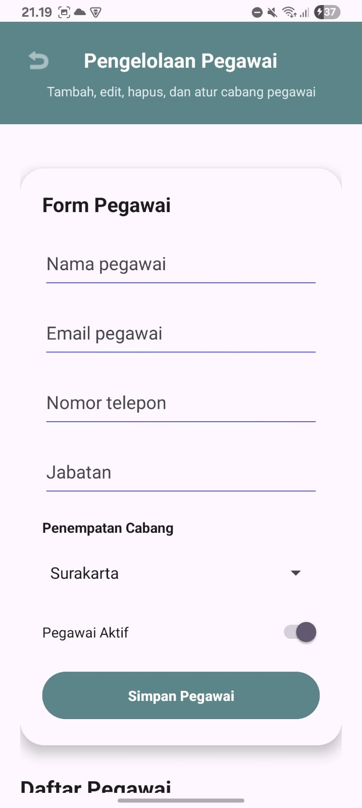</td>
  </tr>
  <tr>
    <td align="center"><b>Data Kategori</b></td>
    <td align="center"><b>Pengaturan Printer</b></td>
    <td align="center"></td>
  </tr>
  <tr>
    <td>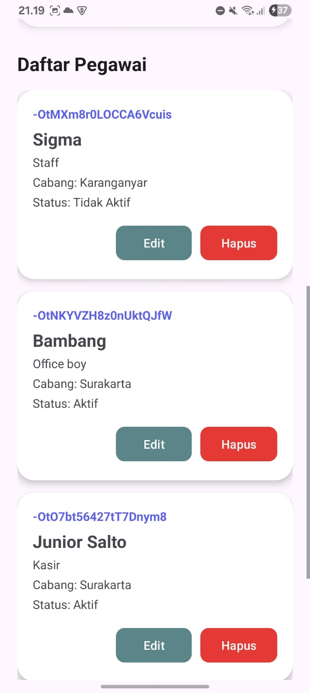</td>
    <td>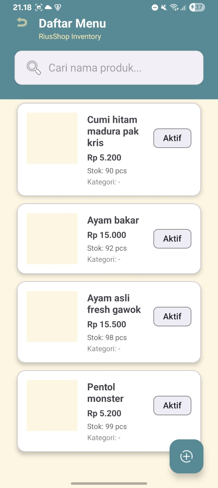</td>
    <td></td>
  </tr>
</table>

## 📋 Daftar Isi

- [Fitur Utama](#fitur-utama)
- [Tech Stack](#tech-stack)
- [Persyaratan Sistem](#persyaratan-sistem)
- [Instalasi & Setup](#instalasi--setup)
- [Struktur Project](#struktur-project)
- [Fitur Autentikasi](#fitur-autentikasi)
- [Panduan Penggunaan](#panduan-penggunaan)
- [Troubleshooting](#troubleshooting)

## ✨ Fitur Utama

### Kasir & Transaksi
- 🛒 **Transaksi** - Tambah produk ke keranjang dan proses pembayaran tunai
- 🧾 **Nota Transaksi** - Generate dan bagikan nota transaksi otomatis
- 🖨️ **Cetak Struk** - Integrasi printer Bluetooth untuk cetak struk

### Laporan & Analitik
- 📊 **Laporan Penjualan** - Rekap pendapatan harian, mingguan, dan bulanan
- 📦 **Produk Terjual** - Daftar produk terlaris hari ini
- 💰 **Estimasi Pendapatan** - Tampilan estimasi pendapatan real-time di dashboard

### Manajemen Toko
- 🏷️ **Manajemen Produk** - Tambah, edit, hapus produk beserta stok dan harga
- 📂 **Kategori Produk** - Kelola kategori dengan status aktif/nonaktif
- 👥 **Manajemen Pegawai** - Data pegawai, jabatan, dan penempatan cabang
- 🏢 **Manajemen Cabang** - Tambah dan kelola data cabang toko

### Autentikasi & Akun
- 🔐 **Login** - Autentikasi pengguna dengan Firebase
- 👤 **Profil Akun** - Manajemen akun dan session pengguna

## 🛠️ Tech Stack

- **Language:** Kotlin
- **Platform:** Android (API Level 24+)
- **Build System:** Gradle (Kotlin DSL)
- **Backend:** Firebase (Firestore, Authentication, Storage)
- **UI Framework:** Android Jetpack (RecyclerView, ViewBinding)
- **Architecture:** MVVM
- **Printer:** Bluetooth Thermal Printer integration
- **Testing:** JUnit, Espresso

## ⚙️ Persyaratan Sistem

- **Android Studio:** 2024.1.0 atau lebih tinggi
- **Android SDK:** API Level 24 (Android 7.0) atau lebih tinggi
- **JDK:** Java 11 atau lebih tinggi
- **Gradle:** 8.0+
- **Kotlin:** 1.9+

## 📦 Instalasi & Setup

### 1. Clone Repository
```bash
git clone https://github.com/Devr1us/penjualannya_adit.git
cd penjualannya_adit/penjualannya_adit-revisilagi
```

### 2. Buka di Android Studio
```bash
# Gunakan Android Studio untuk membuka project
# File > Open > pilih folder penjualannya_adit-revisilagi
```

### 3. Install Dependencies
Android Studio akan otomatis mendownload semua dependencies melalui Gradle. Tunggu hingga proses selesai.

### 4. Setup Local Properties (Optional)
Jika diperlukan, buat file `local.properties`:
```properties
sdk.dir=/path/to/android/sdk
```

### 5. Jalankan Aplikasi
```bash
# Via Android Studio:
# 1. Buka Virtual Device Manager atau hubungkan Physical Device
# 2. Tekan "Run" atau Shift+F10

# Via Terminal:
./gradlew installDebug
```

### 6. Build APK untuk Production
```bash
# Debug APK
./gradlew assembleDebug

# Release APK
./gradlew assembleRelease
```

## 📁 Struktur Project

```
penjualannya_adit-revisilagi/
├── app/                                    # Main application module
│   ├── src/
│   │   ├── main/
│   │   │   ├── java/com/example/penjualan/
│   │   │   │   ├── activity/
│   │   │   │   │   ├── LoginActivity.kt      # Login Screen
│   │   │   │   │   ├── RegisterActivity.kt   # Register Screen
│   │   │   │   │   ├── AccountActivity.kt    # Profile & Account
│   │   │   │   │   └── MainActivity.kt       # Main App
│   │   │   │   ├── manager/
│   │   │   │   │   └── SessionManager.kt     # Session Management
│   │   │   │   ├── model/
│   │   │   │   ├── viewmodel/
│   │   │   │   ├── repository/
│   │   │   │   └── utils/
│   │   │   ├── res/
│   │   │   │   ├── layout/
│   │   │   │   │   ├── activity_login.xml
│   │   │   │   │   ├── activity_register.xml
│   │   │   │   │   ├── activity_account.xml
│   │   │   │   │   └── ...
│   │   │   │   ├── values/
│   │   │   │   ├── drawable/
│   │   │   │   └── menu/
│   │   │   ├── AndroidManifest.xml
│   │   └── test/
│   └── build.gradle.kts
├── gradle/
│   └── wrapper/
├── login_feature_implementation/           # Login Feature (Isolated)
│   ├── login_demo.html                     # HTML Demo
│   ├── kotlin/
│   │   ├── LoginActivity.kt
│   │   ├── RegisterActivity.kt
│   │   ├── AccountActivity.kt
│   │   └── SessionManager.kt
│   └── layouts/
├── settings.gradle.kts
├── build.gradle.kts
├── gradle.properties
├── .gitignore
└── README.md
```

## 🔐 Fitur Autentikasi

### Alur Login & Register

```
┌─────────────────┐
│ Aplikasi Dibuka │
└────────┬────────┘
         │
    ┌────▼─────────────────────┐
    │ Session Ada? (Persistent) │
    └────┬──────────────┬───────┘
         │              │
        YES            NO
         │              │
    ┌────▼────┐    ┌────▼───────────────┐
    │ Account  │    │ Login Activity      │
    │ Activity │    └────┬──────────┬────┘
    └─────────┘         │          │
                    Login    Register
                      │          │
                 ┌────▼┐  ┌─────▼──────┐
                 │ App │  │ Register   │
                 │Home │  │ Activity   │
                 └─────┘  └─────┬──────┘
                              Success
                                │
                          ┌─────▼─────────────┐
                          │ Login Activity    │
                          │ (Auto-fill)       │
                          └────────┬──────────┘
                                   │
                               Login
                                   │
                          ┌────────▼──────┐
                          │ App Home      │
                          │ (Account Saved)
                          └───────────────┘
```

### Session Manager
Menggunakan `SharedPreferences` untuk menyimpan data session:
- Username
- User ID
- Token/Session
- Timestamp login

**Persistent Features:**
- Automatic login jika session masih valid
- Logout menghapus semua session data
- Support multiple user accounts

### Activities Detail

#### LoginActivity.kt
```kotlin
// Responsibilities:
// - Menampilkan form login
// - Validasi input (username, password)
// - Autentikasi user
// - Save session jika login berhasil
// - Navigate ke RegisterActivity atau MainActivity
```

#### RegisterActivity.kt
```kotlin
// Responsibilities:
// - Menampilkan form registrasi
// - Validasi input (username, email, password)
// - Simpan user data
// - Auto-redirect ke LoginActivity setelah berhasil
```

#### AccountActivity.kt
```kotlin
// Responsibilities:
// - Menampilkan profil user
// - Logout functionality
// - Switch account (register akun lain)
// - Edit profil (optional)
```

## 📱 Panduan Penggunaan

### Pertama Kali Membuka Aplikasi
1. Aplikasi langsung menampilkan **Login Screen**
2. Jika belum punya akun, klik **"Belum punya akun? Daftar disini"**
3. Isi form registrasi dan klik **Daftar**
4. Otomatis diarahkan ke Login Screen dengan username terisi

### Login
1. Masukkan username dan password
2. Klik tombol **Login**
3. Jika berhasil, akan diarahkan ke **App Home**
4. Session disimpan secara otomatis

### Logout
1. Buka menu Profile/Account (biasanya di navbar atau settings)
2. Klik tombol **Logout**
3. Akan kembali ke Login Screen
4. Session dihapus dari perangkat

### Switch Account
1. Di Account Activity, klik **Daftar Akun Baru** atau **Login Akun Lain**
2. Akan diarahkan ke Register/Login Activity
3. Daftar atau login dengan akun berbeda

## 🔧 Konfigurasi

### Android Manifest
Pastikan permissions berikut sudah ada di `AndroidManifest.xml`:

```xml
<uses-permission android:name="android.permission.INTERNET" />
<uses-permission android:name="android.permission.ACCESS_NETWORK_STATE" />
```

### ProGuard/R8 (Release Build)
File `proguard-rules.pro` untuk release build:

```properties
-keepclasseswithmembernames class * {
    native <methods>;
}

-keepclasseswithmembernames class * {
    public <init>(android.content.Context, android.util.AttributeSet);
}
```

## 🧪 Testing

### Unit Tests
```bash
./gradlew testDebug
```

### Instrumented Tests (UI)
```bash
./gradlew connectedAndroidTest
```

## 🐛 Troubleshooting

### Masalah: Gradle Sync Gagal
**Solusi:**
- Hapus folder `.gradle`
- Jalankan `./gradlew clean`
- Sync kembali di Android Studio

### Masalah: Build Error - "Kotlin compiler not found"
**Solusi:**
- Pastikan Kotlin plugin sudah installed di Android Studio
- Update Android Studio ke versi terbaru
- Jalankan `./gradlew clean build`

### Masalah: Session tidak tersimpan setelah close app
**Solusi:**
- Periksa file `SessionManager.kt`
- Pastikan SharedPreferences menggunakan mode `MODE_PRIVATE`
- Verify user ID dan token disimpan dengan benar

### Masalah: Login selalu gagal
**Solusi:**
- Cek username dan password di database SQLite
- Verify API endpoint jika menggunakan backend
- Lihat logcat untuk error messages

## 📚 Referensi & Dokumentasi

- [Android Developers](https://developer.android.com/)
- [Kotlin Documentation](https://kotlinlang.org/docs/)
- [Android Jetpack](https://developer.android.com/jetpack)
- [Material Design](https://m3.material.io/)

## 📄 File Dokumentasi Lainnya

- `PROMPT_DAN_KODE.md` - Dokumentasi lengkap implementasi login feature
- `panduan_integrasi.md` - Panduan integrasi ke project utama

## 👨‍💻 Development Info

- **Author:** Adit
- **Repository:** https://github.com/Devr1us/penjualannya_adit.git
- **License:** MIT

---

**Catatan:** Semua fitur autentikasi tersimpan di folder `login_feature_implementation/` agar tidak mengganggu file-file utama project. Ikuti `panduan_integrasi.md` untuk menggabungkannya ke dalam aplikasi utama.
